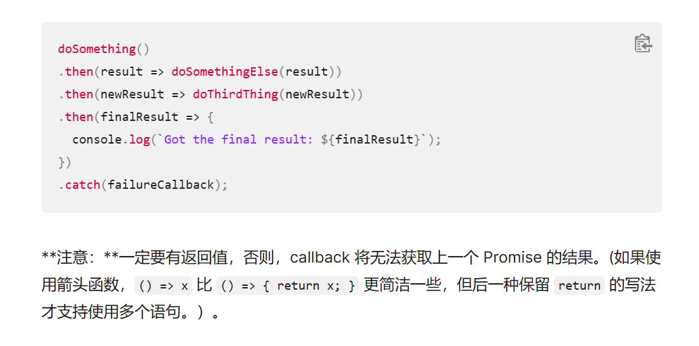

# Axios异步方法

```js
async initDepartments() {
                    const { data } = await axios.get('http://localhost:8080/department/list');
                    this.departments = data.result;
                }
```

```js
                initDepartments() {
                    axios.get('http://localhost:8080/department/list').then(resp => {
                        this.departments = resp.data.result;
                    })
                }
```

**下面这种语法结构不正确，链式调用then函数时，应当有一个返回值，但是我在查阅相关文档  [使用 Promise - JavaScript | MDN (mozilla.org)](https://developer.mozilla.org/zh-CN/docs/Web/JavaScript/Guide/Using_promises#错误传递)**，在尝试返回值以后，还是不能解决，还是需要使用上面的 **箭头函数**，推测可能的问题可能和异步同步处理有关。



```js
                initDepartments() {
                    axios.get('http://localhost:8080/department/list').then(function (resp) {

                        this.departments = resp.data.result;
                    })
                }
```

> 上面这种方法不行

# Vue中使用this调用模型数据的时机

## 问题

在created钩子函数中初始化了部门信息

```js
                // 请求部门信息
                this.initDepartments();
```

希望在钩子函数created函数中调用它，发现`this.departments`始终为空，这是因为同步代码块较异步代码块率先执行。

于是将调用部门信息的代码转移到mounted钩子函数中，发现还是为空，理论上此钩子函数比created要晚执行，但发现，它们执行的顺序还是异步的，两者拿到的`this.departments`似乎不是同一个值

## 解决

最终将代码转移到另外一个事件函数当中，当事件触发时，再调用部门信息，发现问题解决。

