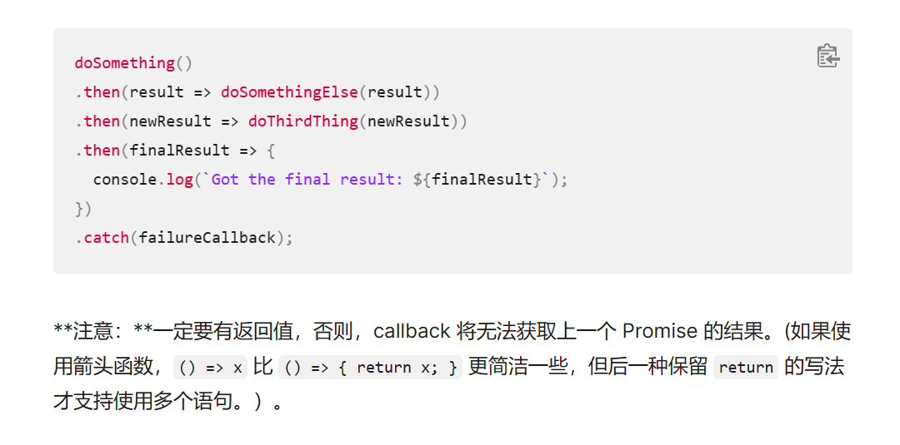

# Axios异步方法

```js
async initDepartments() {
                    const { data } = await axios.get('http://localhost:8080/department/list');
                    this.departments = data.result;
                }
```

```js
                initDepartments() {
                    axios.get('http://localhost:8080/department/list').then(resp => {
                        this.departments = resp.data.result;
                    })
                }
```

**下面这种语法结构不正确，链式调用then函数时，应当有一个返回值，但是我在查阅相关文档  [使用 Promise - JavaScript | MDN (mozilla.org)](https://developer.mozilla.org/zh-CN/docs/Web/JavaScript/Guide/Using_promises#错误传递)**，在尝试返回值以后，还是不能解决，还是需要使用上面的 **箭头函数**，推测可能的问题可能和异步同步处理有关。



```js
                initDepartments() {
                    axios.get('http://localhost:8080/department/list').then(function (resp) {

                        this.departments = resp.data.result;
                    })
                }
```

> 上面这种方法不行

# Vue中使用this调用模型数据的时机

## 问题

在created钩子函数中初始化了部门信息

```js
                // 请求部门信息
                this.initDepartments();
```

希望在钩子函数created函数中调用它，发现`this.departments`始终为空，这是因为同步代码块较异步代码块率先执行。

于是将调用部门信息的代码转移到mounted钩子函数中，发现还是为空，理论上此钩子函数比created要晚执行，但发现，它们执行的顺序还是异步的，两者拿到的`this.departments`似乎不是同一个值

## 解决

最终将代码转移到另外一个事件函数当中，当事件触发时，再调用部门信息，发现问题解决。

# 关于请求JSON数组封装问题

## 背景

前端发送post请求，请求的数据为数组类型，里面每一个元素是json类型数组，后端创建方法接收该参数为medicines，直接使用RequestBody接收发现出错。

```java
@PostMapping("/test")
    public void test( @RequestBody Medicine []medicines){
        System.out.println(Arrays.toString(medicines));
    }
```

报错的提示信息提示 **json数据转化出现错误**

使用postman进行测试，发送原始数据，发现又可以成功，于是可以发现问题在于前端的数据封装上，但是花了很长时间还是无法解决，最终只能采用笨方法即两步走。

## 解决

1. 前端将要发送的数组转化为字符串medicines发送给后端
2. 后端仅仅接收该字符串，再转化为json，再转化为java对象

```java
JSONObject jsonObject = JSONObject.parseObject(medicines);
        Object jsonString = jsonObject.get("medicines");
        List<Medicine> list = JSONArray.parseArray((String)jsonString, Medicine.class);
```

这种改发会使程序的性能收到影响，会导致变慢，但是没有办法，找不到其他的解决办法，可能需要自定义消息转化器。

# 时间转化问题

## 问题：

从数据库中获取的数据展示到前端的时候，所呈现的时间比数据库早一天，即数据库存储2022-12-23，在前端展示时为2022-12-22！

## 分析

从数据库获取的时间绑定到前端Vue里面的模型数据时，以格林标准时间，样式如下：

```java
2022-12-27T16:00:00.000+00:00
```

在前端进行展示的时间的格式为北京时间，和格林标准时间有+8各小时时间时差，**即北京标准时间比格林标准时间慢8各小时**

在数据库中存取的时间是2022-12-27 00:00:00，从数据库中获取绑定到前端Vue数据上面所展示的时间为

2022-12-26 16:00:00，此时有下面两种情况

1. 当使用element自带的date-picker进行展示时，会自动的将格林标准时间转化为北京时间
2. 但是如果直接从模型数据中获取时间，得到的就是上面的格林标准时间所对应的字符串，**这就导致前端展示的时间（具体到天）比后端早一天**

## 解决方案

1. 安装moment js依赖文件

但是我并没有使用Node和npm进行前端开发，因为不熟练

2. 我的想法

在数据库存储时间时，确保存入日期每天的时间大于8点，这样即是前端数据以格林时间展示，还是可以保证前端直接展示的数据和数据库保持一致。

一开始，想着就是改变前端插入数据，确保存入日期每天的时间大于8点，但是在后端数据库展示的时候，发现日期数据**只精确到天**，**而后面的时分秒数据默认是0点**，这样即是前端设置了日期数据，在后端还是无法展示。

**最终，将数据库日期数据的类型由Date改为datetime，展示完整的时间即可**